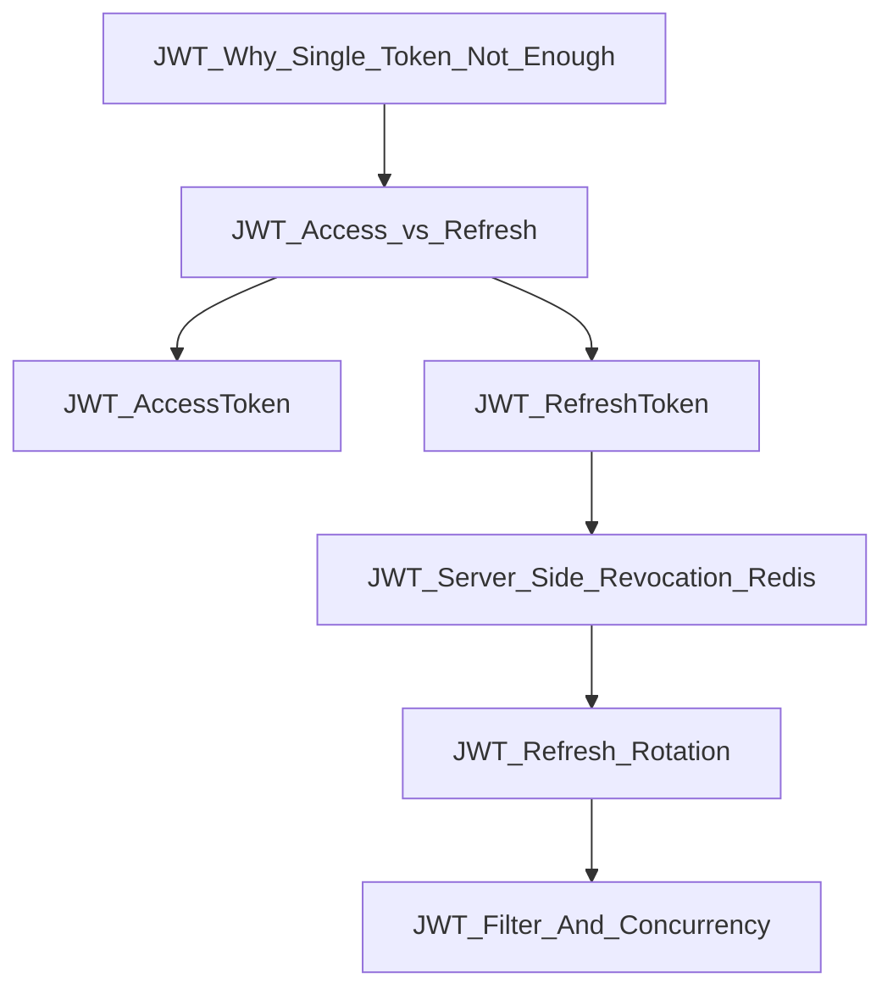

# 2025-12-18 — Day19 JWT（Access/Refresh + Redis 可撤销）

一句话目标：把“可用 + 可撤销 + 可并发验证”的 JWT 登录态做成一条清晰主干。

今日结论（≤5条）：
- access/refresh 拆分：业务只认 access，refresh 只用于 refresh/logout。
- refresh 必须可撤销：用 Redis 保存 refresh key，并让 TTL 与 refresh 对齐。
- refresh rotation：刷新成功即换新 refresh，旧的立刻失效，缩小被盗窗口。
- Filter 只认 access：token 为空/无效/type 不符都放行，但放行≠能进 controller。
- 并发验证结果：threads=30，ok=1，fail=29（符合“只允许一次刷新成功”的目标）。

## 模块目录
- [[JWT_Why_Single_Token_Not_Enough]]
- [[JWT_Access_vs_Refresh]]
- [[JWT_AccessToken]]
- [[JWT_RefreshToken]]
- [[JWT_Server_Side_Revocation_Redis]]
- [[JWT_Refresh_Rotation]]
- [[JWT_Filter_And_Concurrency]]

## 思维导图（主干清晰 + 少连线）

[[链接清单]]（兜底可点）：
- [[JWT_Why_Single_Token_Not_Enough]]
- [[JWT_Access_vs_Refresh]]
- [[JWT_AccessToken]]
- [[JWT_RefreshToken]]
- [[JWT_Server_Side_Revocation_Redis]]
- [[JWT_Refresh_Rotation]]
- [[JWT_Filter_And_Concurrency]]

## 面试 30 秒口述版
- 我用 access/refresh 双 token：access 只做业务访问、短 TTL；refresh 只做续期/登出、长 TTL。
- refresh 必须服务端可撤销：用 Redis 维护 refresh key，TTL 跟 refresh 对齐，logout 就删 key。
- refresh 采用 rotation：每次刷新都换新 refresh，旧的立刻失效，避免被盗后无限续期。
- Filter 只认 access：token 不存在/无效/type 不对就放行交给后续鉴权处理，放行不代表能进 controller。
- 我做了并发测试 threads=30，预期只有 1 次刷新成功，结果 ok=1 fail=29；生产可用 Lua 原子消费进一步稳固。
