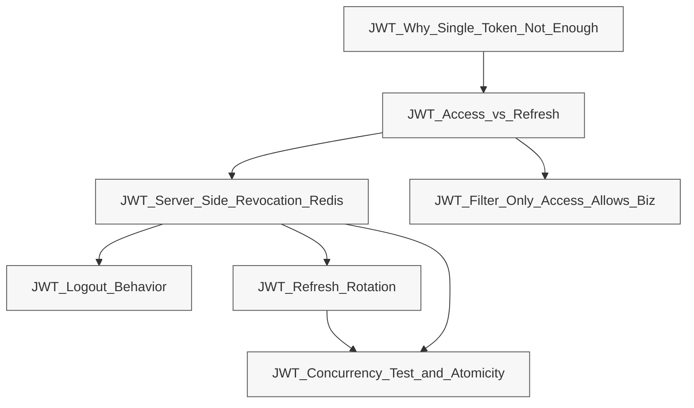

# JWT_MOC

## 主题概览
- access/refresh 双 token、可撤销、rotation、并发测试与过滤链路。

## 链接清单
- [[JWT_Why_Single_Token_Not_Enough]]
- [[JWT_Access_vs_Refresh]]
- [[JWT_Server_Side_Revocation_Redis]]
- [[JWT_Logout_Behavior]]
- [[JWT_Refresh_Rotation]]
- [[JWT_Filter_Only_Access_Allows_Biz]]
- [[JWT_Concurrency_Test_and_Atomicity]]

## 结构图

